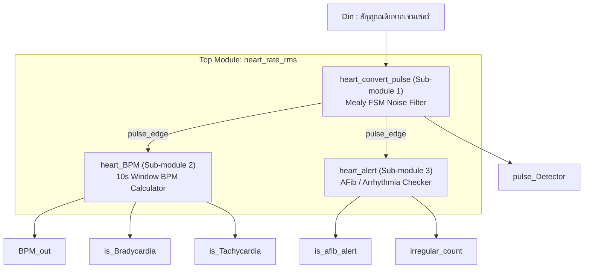

# Heart Rate Monitoring System (Verilog HDL)

ระบบตรวจวัดอัตราการเต้นของหัวใจแบบดิจิทัล (Digital Heart Rate Monitor) ที่ออกแบบและพัฒนาด้วยภาษา Verilog HDL โดยใช้ **Mealy-based Finite State Machine (FSM)** ในการกรองสัญญาณรบกวน, ระบบนับจังหวะเต้นในกรอบเวลา 10 วินาทีเพื่อคำนวณ BPM, รวมถึงระบบแจ้งเตือนภาวะหัวใจเต้นผิดปกติ (Bradycardia, Tachycardia และ Atrial Fibrillation) 

ไฟล์หลักแบบรวมเบ็ดเสร็จ (All-in-One): [`heart_rate_monitor.v`](./heart_rate_monitor.v)

---

## 📌 ฟีเจอร์หลักของระบบ (Features)

1. **Mealy FSM Noise Filtering & Debouncing (กรองสัญญาณรบกวน):**
   * กรองสัญญาณรบกวน (Noise/Spikes) จากเซนเซอร์ โดยต้องตรวจพบสัญญาณ `Din = 1` ต่อเนื่องกันอย่างน้อย 3 รอบสัญญาณนาฬิกา (Clock Cycles) จึงจะถือว่าเป็นชีพจรจริง
   * มีสถานะ `WAIT_LOW` เพื่อป้องกันการนับซ้ำในกรณีที่สัญญาณพัลส์กว้างเกิน 1 รอบ (Debounce)
2. **Real-Time BPM Calculation (คำนวณอัตราการเต้นหัวใจ):**
   * นับจำนวนพัลส์หัวใจจริงภายในกรอบเวลาสังเกตการณ์ 10 วินาที (`WINDOW_LIMIT`)
   * คำนวณค่า $\text{BPM} = \text{Beat Count} \times 6$ อัตโนมัติเมื่อครบ 10 วินาที
3. **Heart Rate Alerts (แจ้งเตือนภาวะหัวใจเต้นผิดปกติ):**
   * **Bradycardia Alert (`is_Bradycardia`):** แจ้งเตือนเมื่ออัตราการเต้นหัวใจ $< 60\text{ BPM}$ (หัวใจเต้นช้า)
   * **Tachycardia Alert (`is_Tachycardia`):** แจ้งเตือนเมื่ออัตราการเต้นหัวใจ $> 100\text{ BPM}$ (หัวใจเต้นเร็ว)
4. **Arrhythmia & Atrial Fibrillation Detection (`is_afib_alert`):**
   * ตรวจจับความแปรปรวนของคาบเวลาระหว่างจังหวะเต้น (Inter-beat interval) หากมีความคลาดเคลื่อนเกิน 12.5% ติดต่อกัน ระบบจะนับสะสม `irregular_count` และเปิดสัญญาณเตือน `is_afib_alert`

---

## 🏗️ โครงสร้างสถาปัตยกรรมโมดูล (Module Architecture)

ไฟล์ `heart_rate_monitor.v` ประกอบด้วยโมดูลย่อยทั้งหมด 4 ส่วน และ 1 Testbench:



### รายละเอียดแต่ละโมดูล

| โมดูล | ชนิด | หน้าที่การทำงาน |
| :--- | :---: | :--- |
| `heart_rate_rms` | **Top Module** | รับสัญญาณ `CLK`, `reset`, `Din` และเชื่อมต่อ Sub-modules ทั้งหมด พร้อมส่งออกสัญญาณ Alert ต่าง ๆ |
| `heart_convert_pulse` | **Sub-module 1** | Mealy FSM (4 States: IDLE, COUNT1, COUNT2, WAIT_LOW) ใช้ D-FF 2 ตัว กรองสัญญาณรบกวนและส่ง `pulse_edge` |
| `heart_BPM` | **Sub-module 2** | ตัวนับกรอบเวลา 10 วินาที สะสมจำนวน Beat แล้วคูณ 6 ส่งออกค่า `BPM_out` พร้อมเปรียบเทียบหา Bradycardia/Tachycardia |
| `heart_alert` | **Sub-module 3** | วัดความคลาดเคลื่อนของคาบเวลาเทียบกับเกณฑ์ 12.5% เพื่อแจ้งเตือน `is_afib_alert` |
| `tb_heart_rate` | **Testbench** | โมดูลจำลองการทดสอบสำหรับ ModelSim โดยเฉพาะ |

---

## 🔄 ตารางการทำงานของ FSM (Mealy State Table)

| Current State (Name) | Current State ($Q_1Q_0$) | Input ($D_{in}$) | Next State ($D_1D_0$) | Output ($Y$ / `pulse_edge`) | คำอธิบาย |
| :---: | :---: | :---: | :---: | :---: | :--- |
| **IDLE** | `00` | `0` | `00` (IDLE) | `0` | ยังไม่มีสัญญาณ |
| **IDLE** | `00` | `1` | `01` (COUNT1) | `0` | พบ High ครั้งที่ 1 |
| **COUNT1** | `01` | `0` | `00` (IDLE) | `0` | สัญญาณหาย ถือเป็น Noise ดีดกลับ IDLE |
| **COUNT1** | `01` | `1` | `10` (COUNT2) | `0` | พบ High ครั้งที่ 2 |
| **COUNT2** | `10` | `0` | `00` (IDLE) | `0` | สัญญาณหาย ถือเป็น Noise ดีดกลับ IDLE |
| **COUNT2** | `10` | `1` | `11` (WAIT_LOW) | **`1`** | **พบ High ครบ 3 ครั้ง ยืนยันพัลส์หัวใจเต้นจริง** |
| **WAIT_LOW**| `11` | `0` | `00` (IDLE) | `0` | สัญญาณลดกลับเป็น 0 พร้อมรับพัลส์รอบใหม่ |
| **WAIT_LOW**| `11` | `1` | `11` (WAIT_LOW) | `0` | สัญญาณยังค้างเป็น 1 อยู่ รอให้ลดลง ไม่นับซ้ำ |

---

## 🧪 วิธีการทดสอบด้วย ModelSim (How to Test)

ไฟล์ `heart_rate_monitor.v` มีโมดูล Testbench (`tb_heart_rate`) ฝังอยู่ภายในไฟล์เดียวกัน ทำให้สามารถคอมไพล์และรันได้โดยตรงทันที

### วิธีที่ 1: รันผ่าน ModelSim Transcript Console (แนะนำ)
เปิดโปรแกรม ModelSim และพิมพ์คำสั่งในหน้าต่าง **Transcript** ด้านล่างดังนี้:

```tcl
# 1. คอมไพล์ไฟล์ heart_rate_monitor.v
vlog heart_rate_monitor.v

# 2. เริ่มการจำลองการทำงานด้วยโมดูล Testbench
vsim -novopt tb_heart_rate

# 3. เพิ่มสัญญาณทั้งหมดลงในหน้าต่าง Waveform
add wave -r /*

# 4. สั่งรันการจำลองจนจบ
run -all
```

### วิธีที่ 2: รันผ่าน ModelSim GUI
1. เปิด ModelSim แล้วสร้าง Project หรือเลือก **File -> Open** เปิดไฟล์ `heart_rate_monitor.v`
2. คลิกขวาที่ไฟล์ เลือก **Compile Selected** (หรือกดปุ่ม Compile)
3. ไปที่แถบ **Library** ด้านซ้าย ขยายโฟลเดอร์ `work`
4. ดับเบิ้ลคลิกที่โมดูล `tb_heart_rate`
5. ในหน้าต่าง **Objects/Structure** คลิกขวาเลือก **Add to Wave -> All items in region**
6. กดปุ่ม **Run -All** หรือพิมพ์ `run -all` ในช่อง Transcript

---

## 📊 สถานการณ์ที่ Testbench ทำการทดสอบ (Test Scenarios)

1. **Test 1 & Test 2 (Noise Glitches):**
   * ป้อนพัลส์สัญญาณรบกวนขนาด 1 cycle และ 2 cycles
   * *ผลลัพธ์:* `pulse_Detector` จะต้องไม่ถูกกระตุ้น (เป็น `0` ตลอด)
2. **Test 3 (Valid Beat):**
   * ป้อนสัญญาณ `Din = 1` กว้าง 3 cycles ติดกัน
   * *ผลลัพธ์:* `pulse_Detector` จะขึ้นเป็น `1` ใน cycle ที่ 3
3. **Test 4 (Wide Pulse Debounce):**
   * ป้อนสัญญาณ `Din = 1` ค้างยาวนาน 6 cycles
   * *ผลลัพธ์:* ตรวจจับชีพจรได้เพียงครั้งเดียว ไม่มีการนับซ้ำ
4. **Test 5 (BPM Calculation & AFib):**
   * ป้อนสัญญาณชีพจรหลาย ๆ จังหวะ พร้อมสร้างจังหวะที่เว้นระยะไม่สม่ำเสมอ
   * *ผลลัพธ์:* ระบบคำนวณ `BPM_out`, ตรวจสอบแจ้งเตือน `is_Bradycardia`/`is_Tachycardia` และส่งสัญญาณเตือน `is_afib_alert` เมื่อพบจังหวะผิดปกติ
