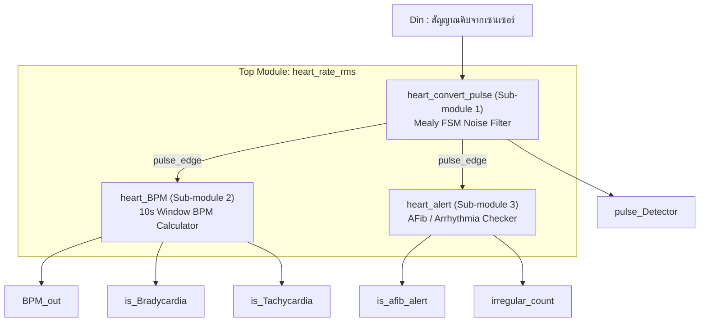

# Heart Rate Monitoring System (Verilog HDL)

ระบบตรวจวัดอัตราการเต้นของหัวใจแบบดิจิทัล (Digital Heart Rate Monitor) ที่ออกแบบและพัฒนาด้วยภาษา Verilog HDL โดยใช้ **Mealy-based Finite State Machine (FSM)** ในการกรองสัญญาณรบกวน, ระบบนับจังหวะเต้นในกรอบเวลา 10 วินาทีเพื่อคำนวณ BPM, รวมถึงระบบแจ้งเตือนภาวะหัวใจเต้นผิดปกติ (Bradycardia, Tachycardia และ Atrial Fibrillation) 

ไฟล์หลักแบบรวมเบ็ดเสร็จ (All-in-One): [`heart_rate_monitor.v`](./heart_rate_monitor.v)

---

## 📌 ฟีเจอร์หลักของระบบ (Features)

1. **Mealy FSM Noise Filtering & Debouncing (กรองสัญญาณรบกวน):**
   * กรองสัญญาณรบกวน (Noise/Spikes) จากเซนเซอร์ โดยต้องตรวจพบสัญญาณ `Din = 1` ต่อเนื่องกันอย่างน้อย 3 รอบสัญญาณนาฬิกา (Clock Cycles) จึงจะถือว่าเป็นชีพจรจริง
   * มีสถานะ `WAIT_LOW` เพื่อป้องกันการนับซ้ำในกรณีที่สัญญาณพัลส์กว้างเกิน 1 รอบ (Debounce)
2. **Real-Time BPM Calculation (คำนวณอัตราการเต้นหัวใจ):**
   * นับจำนวนพัลส์หัวใจจริงภายในกรอบเวลาสังเกตการณ์ 10 วินาที (`WINDOW_LIMIT`)
   * คำนวณค่า $\text{BPM} = \text{Beat Count} \times 6$ อัตโนมัติเมื่อครบ 10 วินาที
3. **Heart Rate Alerts (แจ้งเตือนภาวะหัวใจเต้นผิดปกติ):**
   * **Bradycardia Alert (`is_Bradycardia`):** แจ้งเตือนเมื่ออัตราการเต้นหัวใจ $< 60\text{ BPM}$ (หัวใจเต้นช้า)
   * **Tachycardia Alert (`is_Tachycardia`):** แจ้งเตือนเมื่ออัตราการเต้นหัวใจ $> 100\text{ BPM}$ (หัวใจเต้นเร็ว)
4. **Arrhythmia & Atrial Fibrillation Detection (`is_afib_alert`):**
   * ตรวจจับความแปรปรวนของคาบเวลาระหว่างจังหวะเต้น (Inter-beat interval) หากมีความคลาดเคลื่อนเกิน 12.5% ติดต่อกัน ระบบจะนับสะสม `irregular_count` และเปิดสัญญาณเตือน `is_afib_alert`

---

## 🏗️ โครงสร้างสถาปัตยกรรม 6 บล็อกหลัก (Methodology Architecture)

```
  ┌──────────────────────────────────────────────────────────────────────────────────────────────────┐
  │                                     METHODOLOGY ARCHITECTURE                                     │
  └──────────────────────────────────────────────────────────────────────────────────────────────────┘
    [Block 1: Raw Sensor Input] 
                 │ (Din: 1-bit Serial Stream)
                 ▼
    [Block 2: Mealy FSM Noise Filter (heart_convert_pulse)]
                 │ (pulse_edge / Output Y=1)
        ┌────────┴───────────────────────────┐
        ▼                                    ▼
    [Block 3: BPM Calculator Engine]     [Block 4: Rhythm & AFib Engine]
    (heart_BPM: 10s Window & ×6)         (heart_alert: Interval Tolerance 12.5%)
        │                                    │
        └─────────────────┬──────────────────┘
                          ▼
    [Block 5: Diagnostic Indicators & Alert Logic] (Bradycardia, Tachycardia, AFib Flags)
                          │
                          ▼
    [Block 6: Top Module Integration (heart_rate_rms)] (BPM_out, pulse_Detector, Alerts)
```



### รายละเอียดแต่ละโมดูล

| บล็อก | โมดูล | หน้าที่การทำงาน |
| :---: | :--- | :--- |
| **Block 1** | `Din` | รับสัญญาณไบนารีอนุกรม 1 บิตดิบจากเซนเซอร์ PPG/ECG (`0` = Baseline, `1` = Pulse Peak) |
| **Block 2** | `heart_convert_pulse` | Mealy FSM (4 States) กรองสัญญาณรบกวน ต้องพบ High 3 cycles ติดกันถึงจะส่ง `pulse_edge` |
| **Block 3** | `heart_BPM` | นับจำนวน Beat ในหน้าต่าง 10 วินาที และคำนวณ $\text{BPM} = \text{Beat Count} \times 6$ |
| **Block 4** | `heart_alert` | วัดความคลาดเคลื่อนของคาบเวลา (Tolerance $> 12.5\%$) และนับ `irregular_count` |
| **Block 5** | Diagnostic Alerts | วงจรเปรียบเทียบเงื่อนไขเตือน `is_Bradycardia`, `is_Tachycardia`, `is_afib_alert` |
| **Block 6** | `heart_rate_rms` | **Top Module** เชื่อมต่อสัญญาณและ Clock/Reset ภายในทั้งหมด ส่งออกพอร์ตภายนอก |

---

## 🔄 ตารางการทำงานของ FSM (Mealy State Table)

| Current State (Name) | Current State ($Q_1Q_0$) | Input ($D_{in}$) | Next State ($D_1D_0$) | Output ($Y$ / `pulse_edge`) | คำอธิบาย |
| :---: | :---: | :---: | :---: | :---: | :--- |
| **IDLE** | `00` | `0` | `00` (IDLE) | `0` | ยังไม่มีสัญญาณ |
| **IDLE** | `00` | `1` | `01` (COUNT1) | `0` | พบ High ครั้งที่ 1 |
| **COUNT1** | `01` | `0` | `00` (IDLE) | `0` | สัญญาณหาย ถือเป็น Noise ดีดกลับ IDLE |
| **COUNT1** | `01` | `1` | `10` (COUNT2) | `0` | พบ High ครั้งที่ 2 |
| **COUNT2** | `10` | `0` | `00` (IDLE) | `0` | สัญญาณหาย ถือเป็น Noise ดีดกลับ IDLE |
| **COUNT2** | `10` | `1` | `11` (WAIT_LOW) | **`1`** | **พบ High ครบ 3 ครั้ง ยืนยันพัลส์หัวใจเต้นจริง** |
| **WAIT_LOW**| `11` | `0` | `00` (IDLE) | `0` | สัญญาณลดกลับเป็น 0 พร้อมรับพัลส์รอบใหม่ |
| **WAIT_LOW**| `11` | `1` | `11` (WAIT_LOW) | `0` | สัญญาณยังค้างเป็น 1 อยู่ รอให้ลดลง ไม่นับซ้ำ |

---

## 🧪 วิธีการทดสอบด้วย ModelSim (How to Test)

ไฟล์ `heart_rate_monitor.v` รวม Design Modules และ Testbench (`tb_heart_rate`) ไว้ด้วยกัน สามารถรันผ่าน **Transcript Console** ใน ModelSim ได้ทันที:

```tcl
# 1. ปิดการจำลองเดิม (ถ้ามี)
quit -sim

# 2. คอมไพล์ไฟล์
vlog heart_rate_monitor.v

# 3. เริ่ม Simulation
vsim -voptargs=+acc tb_heart_rate

# 4. เพิ่มสัญญาณตามลำดับที่อ่านง่าย (Top-to-Bottom Dataflow)
add wave /tb_heart_rate/CLK
add wave /tb_heart_rate/reset
add wave /tb_heart_rate/Din
add wave /tb_heart_rate/pulse_Detector
add wave /tb_heart_rate/BPM_out
add wave /tb_heart_rate/irregular_count
add wave /tb_heart_rate/is_Bradycardia
add wave /tb_heart_rate/is_Tachycardia
add wave /tb_heart_rate/is_afib_alert

# 5. สั่งรันและขยายดูกราฟเต็ม
run -all
wave zoomfull
```

---

## 📊 สถานการณ์ที่ Testbench ทำการทดสอบ (Test Scenarios)

1. **Test 1 & Test 2 (Noise Glitches):**
   * ป้อนพัลส์สัญญาณรบกวนขนาด 1 cycle และ 2 cycles
   * *ผลลัพธ์:* `pulse_Detector` จะต้องไม่ถูกกระตุ้น (เป็น `0` ตลอด)
2. **Test 3 (Valid Beat):**
   * ป้อนสัญญาณ `Din = 1` กว้าง 3 cycles ติดกัน
   * *ผลลัพธ์:* `pulse_Detector` จะขึ้นเป็น `1` ใน cycle ที่ 3
3. **Test 4 (Wide Pulse Debounce):**
   * ป้อนสัญญาณ `Din = 1` ค้างยาวนาน 6 cycles
   * *ผลลัพธ์:* ตรวจจับชีพจรได้เพียงครั้งเดียว ไม่มีการนับซ้ำ
4. **Test 5 & Test 6 (BPM Calculation & AFib):**
   * ป้อนสัญญาณชีพจรหลาย ๆ จังหวะ พร้อมสร้างจังหวะที่เว้นระยะไม่สม่ำเสมอ
   * *ผลลัพธ์:* ระบบคำนวณ `BPM_out`, ตรวจสอบแจ้งเตือน `is_Bradycardia`/`is_Tachycardia` และส่งสัญญาณเตือน `is_afib_alert` เมื่อพบจังหวะผิดปกติ
